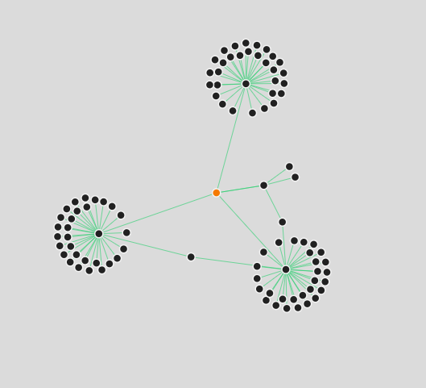

# my-github-network
Find out all the coders linked to you via Github. Check out your [github network](https://my-github-network.herokuapp.com/).

### About

This is a sample github network of a Github user.

All you need is a Github username. Your github username is https://github.com/{username}

The github network app implemented here can generate a network of `Level 1` consisting of followers of followers of a user, followers of user and user itself in an orange node. This is done for the performance issues. To generate a larger network graph, fork the project and change the value of `$level` variable in `github.php` to any other value than `1`.

**Remember** that the time taken for generating the network increases exponentially for each increment to the value of  `$level` variable.

### Credits
Author: [Ravgeet Dhillon](https://github.com/ravgeetdhillon)

Tools | Info
-- | --
[D3.js](http://d3js.org) | A Javascript library to create graphs.
[Github API](https://developer.github.com/v3/) | To fetch all the data related to the user.
